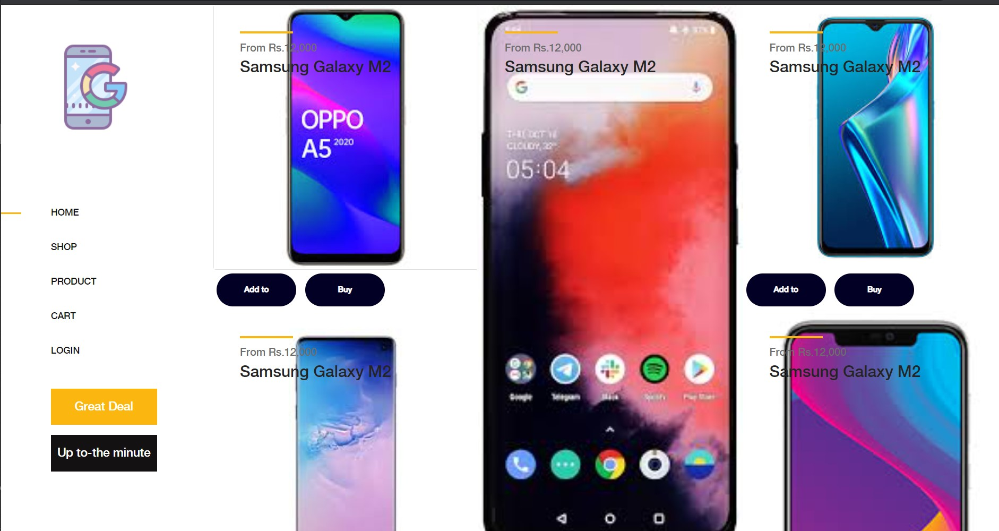
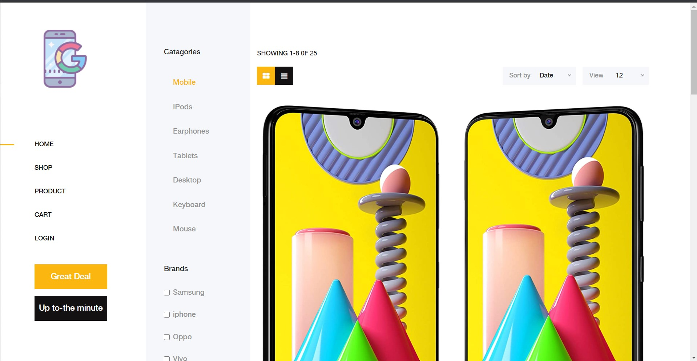
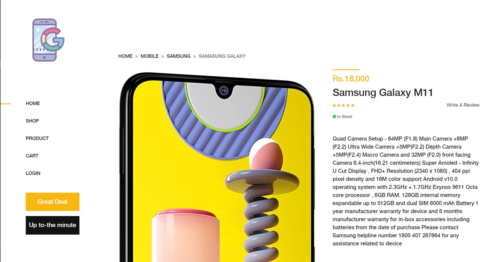
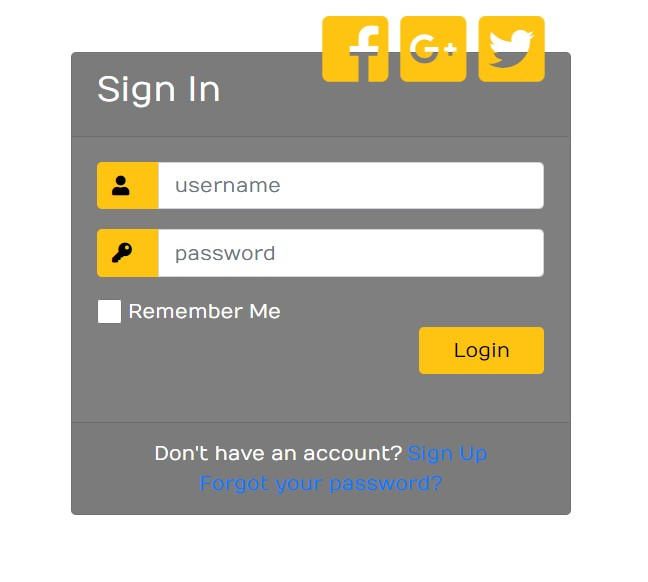
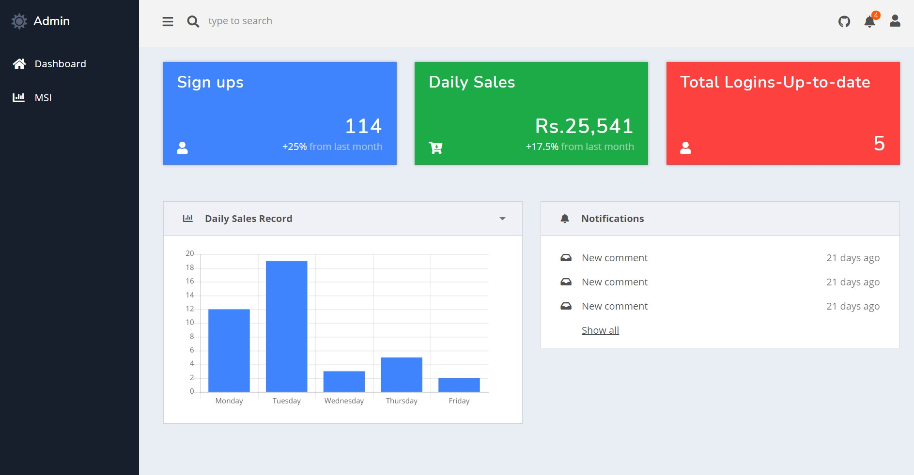
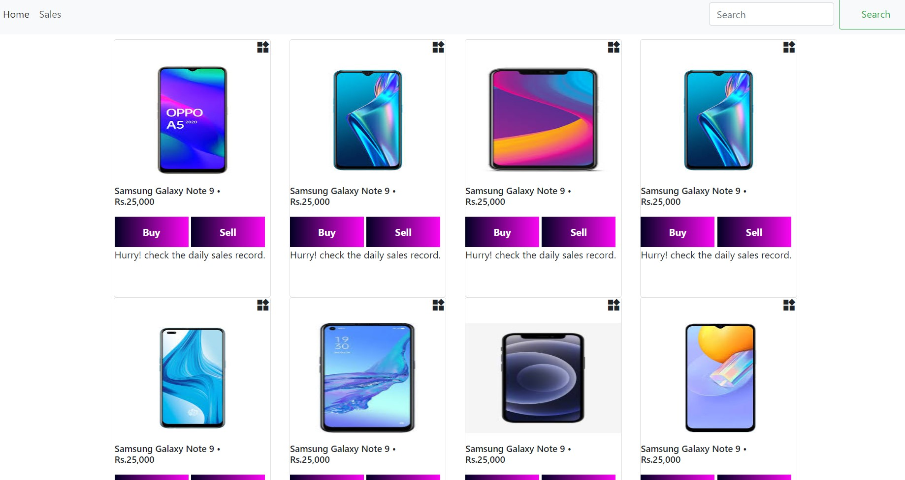

# e-shop
## What will we Cover?
<li>The UI focuses on ease of use.</li>
<li>It has a lots of features : 
    1. Functional side and footer navigation bars fro easy access to. 
    2. Focus on hover effect : it focuses the texts on hover.</li>
 <li>It has admin page in which we can check over the MSI reports.</li>

## ScreenShots

## Components
<li>HTML : To make it rsponsive we have used Bootstrap .</li>
<li> Js : <ul> 1.Hover effect</ul> 
          <ul> 2.Transition </ul>
          <ul> 3.Newsletter </ul></li>
<li>SCSS: Used for styling the buttons, pages and the layout.</li> 

## Design
The content of this section will depend on whether a design already exists, or whether creating a design is a part of the scope of work.
<h3>Responsive designs</h3>
To make the design responsive we have used Bootstrap
<h3>Business acumen</h3>
The perspective behind the e-shop to make it feasible with great user interface that catch eye.  
<h3>It has full of features available : Home , Admin, Cart, Product pages </h3>

## Elements
<li> It has seperate login for the customers and the admin that basically checks out the total sell and we have the option to buy</li>
<li>Specific functionality around search</li>
<li>Performance requiremets</li>
